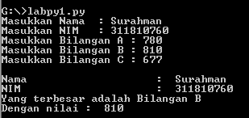

# labpy1

Cara membuat program bilangan terbesar python menggunakan sublime text

1. Buka Sublime Text

2. Ikuti coding seperti berikut

3. Setelah selesai lalu simpan (save) dan pilih format file seperti berikut

4. code input (kode ini di gunakan untuk memasukan input-an pada program)

5. code if

6. code elif

7. code else

8. code output (kode ini di gunakan untuk menampilkan hasil dari program)

9. buka cmd lalu buka file py (python) yang telah di buat dan pastikan sesuai tempat file tersebut berada seperti berikut

10. Masukan inputan seperti berikut:

    Contoh bilangan terbesar A

    Contoh bilangan terbesar B

    Contoh Bilangan terbesar C

Sekian dari saya

Terima kasih